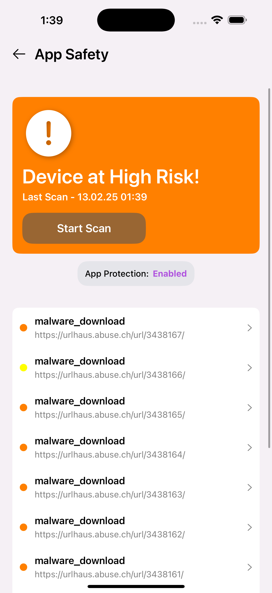
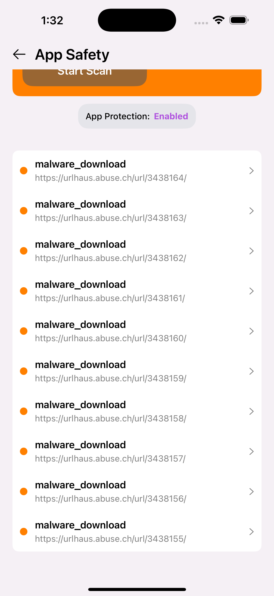
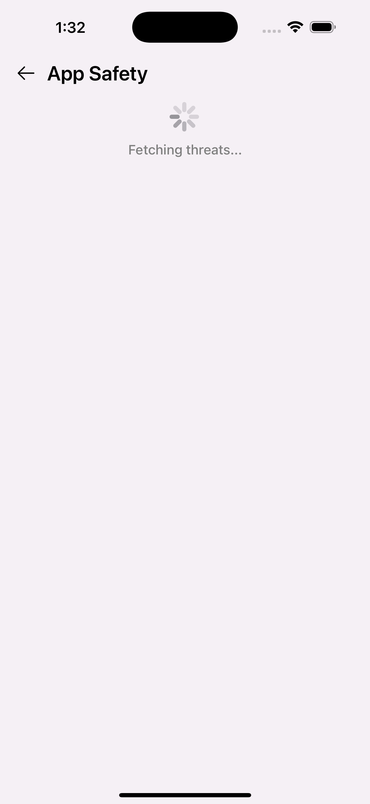
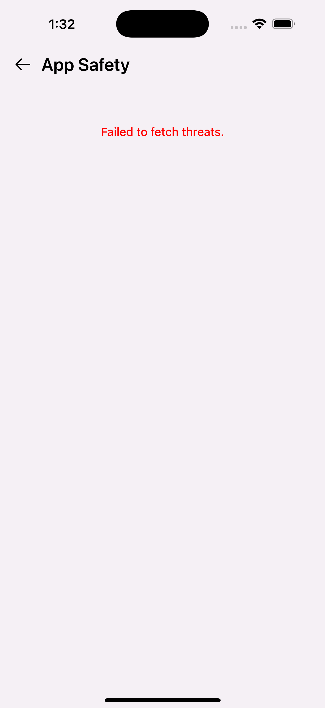

# 🚀 Icaro Assignment

Hi, I am **Jai Nijhawan**, and this is the **iOS Development Assignment** given to me.  
This project is built using **UIKit & MVVM Architecture** and follows clean coding practices.  

Below are the **three states of the app**:

---

## ✅ Success State
The app successfully fetches and displays recent malware threats.

| Home Screen | Threat List |
|------------|------------|
|  |  |

---

## 🔄 Loading State
The app shows a loading indicator while fetching the latest threats.

| Loading Screen |
|---------------|
|  |

---

## ❌ Error State
If the API request fails, the app displays an error message.

| Error Screen |
|-------------|
|  |

---

## 📌 Features

- **Retrieves Recent Malware URLs** from a security API
- Displays threats in a **table view with two sections**
- Shows **loading, success, and error states**
- Uses **MVVM Architecture & Dependency Injection**
- Programmatic UI with **Auto Layout**
- Built-in **Network Layer & Service Layer**

---

## 🛠 Tech Stack

- **Swift 5**
- **UIKit**
- **MVVM Architecture**
- **Networking with URLSession**
- **Auto Layout (Programmatic UI)**

---

## 🛡 API Used

- **Retrieve Recent Malware URLs**  
  **Endpoint:**  
  ```sh
  GET https://urlhaus-api.abuse.ch/v1/urls/recent/limit/10/
